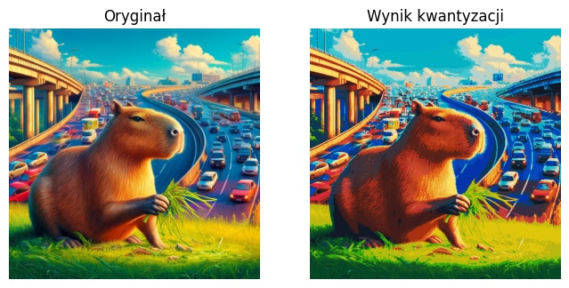

# Polish Artificial Intelligence Olympiad 2024 – Selected Solutions

This repository contains my algorithmic and machine learning solutions for the **Polish Artificial Intelligence Olympiad 2024**, where I achieved the status of **Finalist (Top 30 in Poland)**[cite: 1]. 

The repository features implementations spanning deep learning model optimization, computer vision, adversarial robustness, and custom clustering algorithms. The solutions were developed in Python using PyTorch, NumPy, and scikit-learn[cite: 1].

---

## 🏆 Featured Solutions

### 1. Deep Neural Network Pruning
**Score:** 1.45 / 1.50 | **Inference Time:** ~1.29s

* Implemented a structural magnitude-based pruning algorithm for a Multi-Layer Perceptron (MLP) to maximize sparsity without compromising inference accuracy on a regression task.
* Applied aggressive initial thresholding (L1-norm magnitude) to instantaneously drop redundant connections and reduce weight matrix density.
* Designed a rigorous fine-tuning loop (via Adam optimizer) enforcing hard masking post-gradient-update to recover representational capacity while strictly maintaining zeroed parameters.

### 2. Custom Color Quantization Engine
**Score:** 1.50 / 1.50 (Max Score)

* Developed an image quantization algorithm mapping complex inputs to exactly 37 clusters, constrained by a custom vibrancy-driven objective function.
* Applied K-Means spatial clustering to derive the optimal base centroids minimizing Mean Squared Error (MSE).
* Engineered a custom heuristic optimizer that dynamically anchors standard centroids toward the RGB cube vertices to penalize "dull" colors and strictly enforce deterministic output constraints.

#### **Visual Results**

  

### 3. Adversarial Network Attacks (PGD)
**Score:** 1.00 / 1.00 | **SSIM:** 0.87 | **Max Distance:** 0.27 | **Time:** ~12.7s

* Designed a targeted vulnerability assessment system for a Convolutional Neural Network (CNN) to drastically reduce its classification accuracy via imperceptible adversarial perturbations.
* Implemented an iterative Projected Gradient Descent (PGD) / FGSM hybrid attack in PyTorch.
* Enforced strict geometric clipping (distance bound <= 0.3, valid image domain [-1, 1]) to ensure the perturbations remained imperceptible to the human eye while maintaining a high Structural Similarity Index.

### 4. Object Tracking in Computer Vision
**Score:** 1.25 / 1.50 | **Accuracy:** Task 1: 100% (1.22s), Task 2: 76% (1.49s), Task 3: 94% (5.06s)

* Developed an autonomous object detection and tracking pipeline for raw video sequences (shell game puzzle) with and without pre-computed bounding boxes.
* Implemented a motion extrapolation model that predicts object positions during occlusions using historical velocity vectors and adaptive smoothing factors.
* Integrated custom pixel-based K-Means segmentation to dynamically estimate object centroids in real-time from completely unlabeled raw image data.

---

## 📚 Additional Tasks

### Imbalanced Classification
**Score:** 0.96 / 1.00
* Designed a lightweight, bottleneck-style CNN binary classifier to distinguish classes within an intentionally imbalanced dataset.
* Utilized architectural regularization (minimizing fully connected parameters) to successfully prevent overfitting without relying on complex augmentation pipelines.

### NLP Semantic Riddle Solver
**Score:** 0.70 / 1.50 | **Time:** ~26.3s
* Built an embedding-based Information Retrieval system utilizing pre-trained Word2Vec models for the Polish language to solve semantic word puzzles.
* Applied TF-IDF weighting to dynamically penalize common vocabulary and isolate key semantic markers, evaluating candidate answers via Cosine Similarity.

---

## ⚠️ Note on Execution

The code provided in these Jupyter Notebooks was developed and submitted within the strict time limits of the Olympiad. Please note that the original datasets provided by the competition organizers (such as specific image sets, video frames, and dictionary embeddings) are **not included** in this repository due to size constraints and data hosting availability. 

These notebooks are published to demonstrate the algorithmic approach, custom PyTorch implementations, and mathematical problem-solving skills.